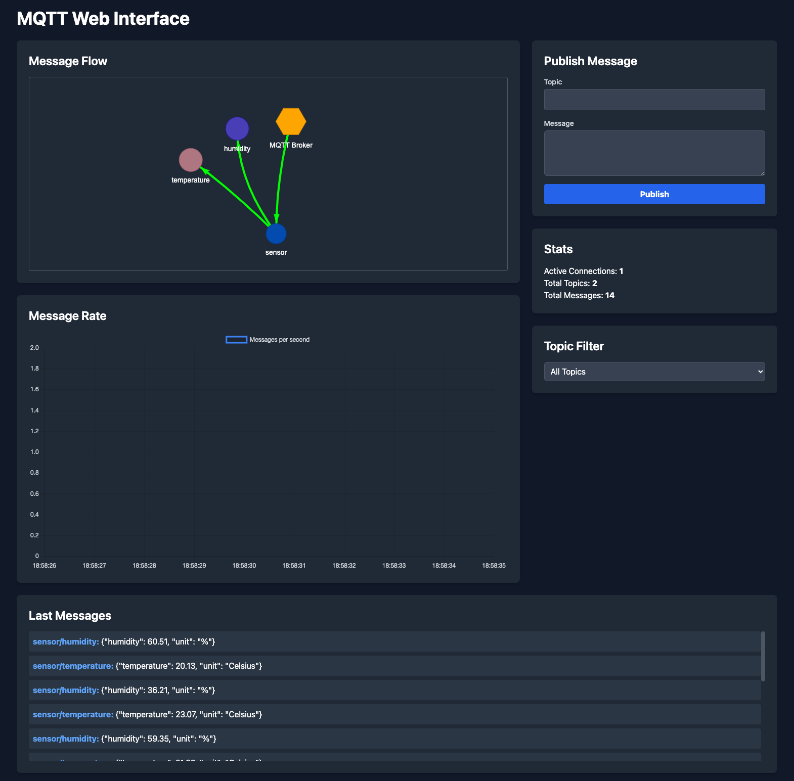
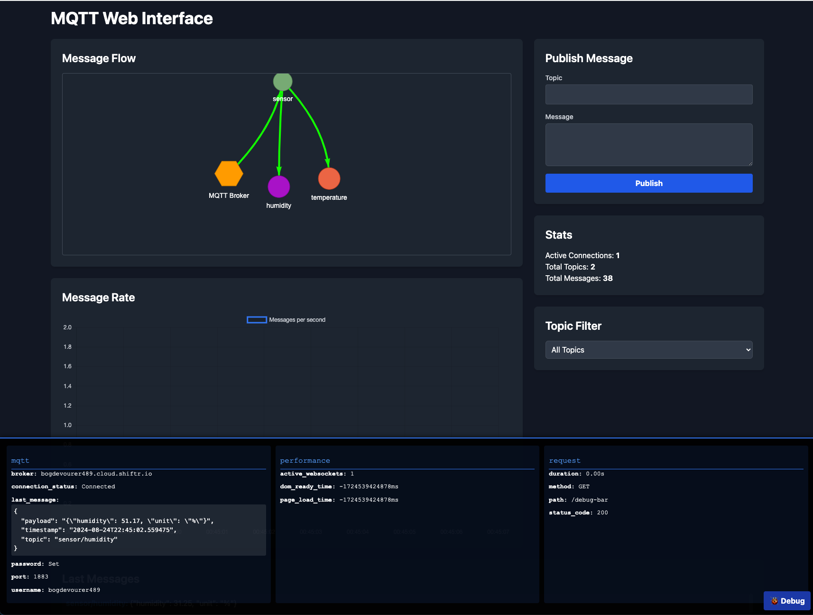

# MQTT Web Interface

## Description

MQTT Web Interface is an open-source web application that provides a real-time visualization of MQTT (Message Queuing Telemetry Transport) message flows. It allows users to monitor MQTT topics, publish messages, and view message statistics through an intuitive web interface.

## Screenshot





## Features

- Real-time visualization of MQTT topic hierarchy and message flow
- Ability to publish messages to MQTT topics
- Display of message statistics (connection count, topic count, message count)
- Interactive network graph showing topic relationships
- Dockerized for easy deployment
- Debug Bar for enhanced developer insights
- Flexible configuration for both development and production environments

## Installation

### Using Docker (Recommended)

You can quickly get started with the MQTT Web Interface using Docker:

```bash
docker pull terdia07/mqttui:v1.0.0
docker run -p 5000:5000 terdia07/mqttui:v1.0.0
```

Then access the application at `http://localhost:5000`

### Manual Installation

1. Clone the repository:
   ```bash
   git clone https://github.com/terdia/mqttui.git
   ```
2. Navigate to the project directory:
   ```bash
   cd mqttui
   ```
3. Install the required dependencies:
   ```bash
   pip install -r requirements.txt
   ```

## Usage

1. Set up your MQTT broker details:
   - If using Docker, you can pass environment variables:
     ```bash
     docker run -p 5000:5000 -e MQTT_BROKER=your_broker_address -e MQTT_PORT=1883 terdia07/mqttui:v1.0.0
     ```
   - If running manually, set environment variables or modify `app.py` directly.

2. Run the application:
   - If using Docker, the application starts automatically.
   - If installed manually, run:
     ```bash
     python app.py
     ```

3. Open a web browser and navigate to `http://localhost:5000` to access the interface.

4. Use the interface to:
   - View the MQTT topic hierarchy
   - See real-time message flows
   - Publish messages to topics
   - Monitor connection and message statistics

## Configuration

The following environment variables can be used to configure the application:

- `DEBUG`: Set to `True` for development mode, `False` for production (default: `False`)
- `PORT`: The port on which the application will run (default: `5000`)
- `MQTT_BROKER`: The address of your MQTT broker (default: 'localhost')
- `MQTT_PORT`: The port of your MQTT broker (default: 1883)
- `MQTT_USERNAME`: The username for authenticated connection (optional)
- `MQTT_PASSWORD`: The password for authenticated connection (optional)
- `MQTT_KEEPALIVE`: Keep-alive time for MQTT connection (default: 60)
- `MQTT_VERSION`: MQTT protocol version to use (default: '3.1.1')

## Development Mode

To run the application in development mode:

1. Set `DEBUG=True` in your `.env` file or export it as an environment variable.
2. Run the application using Python or Docker as described above.

In development mode, the application uses Flask's built-in development server with debug features and the Debug Bar enabled.

## Production Deployment

For production deployment:

1. Ensure `DEBUG=False` in your environment.
2. Use the Docker setup for the most straightforward deployment.
3. The application will use Gunicorn with eventlet workers for better performance and concurrency.

## Contributing

We welcome contributions to the MQTT Web Interface project! Here's how you can contribute:

1. Fork the repository
2. Create a new branch (`git checkout -b feature/AmazingFeature`)
3. Make your changes
4. Commit your changes (`git commit -m 'Add some AmazingFeature'`)
5. Push to the branch (`git push origin feature/AmazingFeature`)
6. Open a Pull Request

Please make sure to update tests as appropriate and adhere to the project's coding standards.

## Issues

If you encounter any problems or have suggestions for improvements, please open an issue on the GitHub repository. When reporting issues, please provide as much detail as possible, including:

- A clear and descriptive title
- Steps to reproduce the issue
- Expected behavior
- Actual behavior
- Any error messages or screenshots

## License

This project is licensed under the MIT License - see the [LICENSE.md](LICENSE.md) file for details.

## Acknowledgments

- [Flask](https://flask.palletsprojects.com/) - The web framework used
- [Socket.IO](https://socket.io/) - For real-time, bidirectional communication
- [Paho MQTT](https://www.eclipse.org/paho/) - MQTT client library
- [Vis.js](https://visjs.org/) - For network visualization
- [Chart.js](https://www.chartjs.org/) - For creating responsive charts

## Contact

Project Link: [https://github.com/terdia/mqttui](https://github.com/terdia/mqttui)

## Disclaimer

This software is provided "as is", without warranty of any kind, express or implied. Use at your own risk.